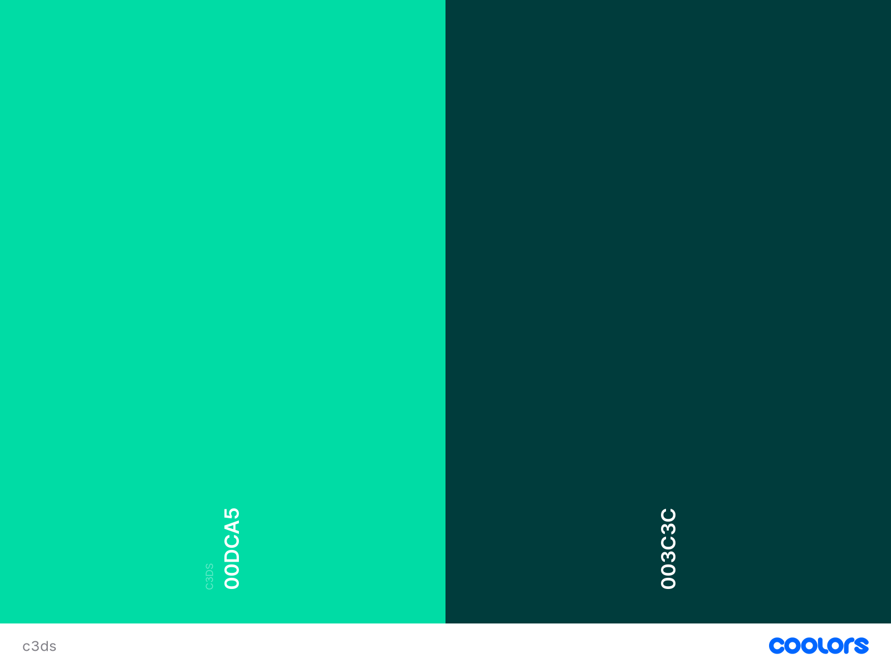

# Centre for Climate Communication & Data Science (C3DS)

Summary of site


[Visit the  live website here]()

<br>

## Contents
----

### [User Experience (UX)](#user-experience-ux-1)
- [Purpose](#purpose)
- [User Stories](#user-stories)
  - [First Time Visitors](#first-time-visitor-goals)
  - [Returning Visitors](#returning-visitor-goals)
  - [Frequent Users](#frequent-visitor-goals)

### [Design](#design-1)
- [Colour Scheme](#colour-scheme)
- [Typography](#typography)
- [Wireframes](#wireframes)

### [Database and Logic](#database-and-logic-1)
- [User Journey](#user-journey)
- [Epics](#epics)
- [Database](#database)

### [Project Structure](#project-structure-1)
- [Apps](#apps)
  - [Home](#home)
  - [About](#about)
  - [People](#people)
  - [Research](#research)
  - [Resources](#resources)
  - [Events](#events)

### [Features](#features-1)
- [Existing Features](#existing-features)
  - [Homepage](#homepage)
  - [Next page](#next_page)
- [Accessibility](#accessibility)
- [Future Features](#future-features)

### [Technologies](#technologies-1)

### [Version Control](#version-control-1)

### [Deployment](#deployment-1)

### [Testing](#testing-1)
- [Function Testing](#function-testing)
- [User Story Testing](#user-story-testing)
- [Lighthouse](#lighthouse)

<br>

----

<br>

## User Experience (UX)
### **Purpose**

Enter purpose description 

<br>

### User Stories
### **Client Goals**
- Inform partners and any interested parties of the Centre's research aims and findings
- Provide useful resources to other researchers and organisations 
- Create a strong identity for the Centre
- Be accessible to admin within the Centre to update as/when needed

<br>

### **Visitor Goals** 
- Find information on Centre activities and research
- Contact the Centre
- Find information about the Centre team
- Find information about Centre partners
- Find publications relating to the Centre's team and/or activities

<br>

----

## Design
### **Colour Scheme**

The colour scheme was chosen to be in keeping with the University of Exeter branding as detailed on their [Brand Portal](https://brand.exeter.ac.uk/).



<br>

### **Typography**

Typography was also chosen to be in keeping with the brand identity of the University of Exeter and so Outfit Font was used for the majority of the text throughout.


<br>

### **Wireframes**
[Balsamiq Wireframing Software](https://balsamiq.com/) was used to create the wireframes.
<details>
<summary>Homepage (mobile)</summary>


</details>
<details>
<summary>Homepage (desktop)</summary>


</details>

<br>

<details>
<summary>People Page (mobile)</summary>


</details>
<details>
<summary>People Page (desktop)</summary>


</details>

<br>

<details>
<summary>About Page (mobile)</summary>


</details>
<details>
<summary>About Page (desktop)</summary>


</details>

<br>

<details>
<summary>Contact Page (mobile)</summary>


</details>
<details>
<summary>Contact Page (desktop)</summary>


</details>

<br>

<details>
<summary>Publications Page (mobile)</summary>


</details>
<details>
<summary>Publications Page (desktop)</summary>


</details>

<br>

<details>
<summary>Events Page (mobile)</summary>


</details>
<details>
<summary>Events Page (desktop)</summary>


</details>

<br>

----

## Database and Logic

Careful consideration was taken in the planning stages of this project. Initial user journeys were mapped out for both the admin and general user. From these an ER Diagram was created.

### **User Journey**


<br>


<br> 


<br>

### **Database**


<br>

----

## Project Structure
### **Apps:**
C3DS has a total of ... Apps. These are:
* 


These are outlined with their corresponding models below.

#### HOME

  

Models:

<br>

#### ABOUT

 

Models:


<br>

#### PEOPLE


Models:


<br>

#### RESEARCH


Models:


<br>

#### RESOURCES


Models:


<br>

#### EVENTS

  
Models:


---

## Features
### **Existing Features**

Homepage
Scrolling hero image
[](https://gyazo.com/858d147735bb60ad15a8ddd00b77b85a)

<br>

### **Accessibility**
In addition to being best practice, having an accessible website is extremely high on the list of requirements for the target audience. Close attention has been paid to the following in order to ensure the site is as accessible as possible:
- Clear and simple font styling, avoiding any cursive or calligraphic scripts.
- Contrasting colour scheme
- Use of semantic HTML
- Ensuring all images have an alt description for screen readers or where the image cannot be loaded. Also ensuring that these are as descriptive as possible.

<br>

### **Future Features**
In the future there are features and developments that it would be useful to consider adding to create an even better user experience of this website. They include:

- A user login platform where researchers/partners can complete a form to upload publications

<br>

----

## Technologies
### **Languages Used**
This website has been written in HTML, CSS, JavaScript & Python.

<br>

**Frameworks, Libraries and Programs Used**
- [Django](https://www.djangoproject.com/): Main framework used to create website
- [ElephantSQL](https://customer.elephantsql.com/login): To hold databases
- [Heroku](https://dashboard.heroku.com/apps): To Deploy
- [Bootstrap v5.3](https://getbootstrap.com/): Framework for styling
- [Cloudinary](https://cloudinary.com/users/login)
- [Github](https://github.com/): To host repositories
- [Gitpod](https://www.gitpod.io/): To code
- [Miro](https://miro.com/app/dashboard/): To create ER diagrams and mapping user journey
- [FontAwesome](https://fontawesome.com/): For icons used throughout
- [GoogleFonts](https://fonts.google.com/): For fonts used in the body and logo for the site
- [Coolors](https://coolors.co/): To create a colour palette
- [Balsamiq](https://balsamiq.com/): To wireframe the site
- [Favicon.io](https://favicon.io/): To create a Favicon
- [Am I Responsive](https://ui.dev/amiresponsive): To test site responsiveness and capture image across different devices
- [Birme](https://www.birme.net/): To resize images and convert to webp
- [Gyazo](https://gyazo.com/): To create GIFs for the README
- [SVG Crop](https://svgcrop.com/): To crop SVG files

<br>

----

## Version Control
Version control has been maintained using Git. The code written for this website has been updated via regular commits to Github. These serve as a record of development and changes made.

The commit history can be viewed [here](https://github.com/llewellynksj/c3ds/commits/main)

<br>

----

## Deployment

At the time of writing (3rd November 2023), this project is deployed on [Heroku](https://dashboard.heroku.com/apps). Below are the steps taken.
### Setup
#### Prepare your IDE
1. Install dj_database_url and psycopg2
```
pip3 install dj_database_url==0.5.0 psycopg2
```
2. At this point if using Cloudinary you can install now
```
pip3 install dj3-cloudinary-storage
```
3. Create your requirements.txt file
```
pip3 freeze -- local > requirements.txt
```
4. Create your Django project
```
django-admin startproject myprojectname .
```
5. Create your first project app
```
python3 manage.py startapp myappname
```
6. Add your new app to installed apps in your project settings.py
```
INSTALLED_APPS = [
    'django.contrib.admin',
    'django.contrib.auth',
    'django.contrib.contenttypes',
    'django.contrib.sessions',
    'django.contrib.messages',
    'django.contrib.staticfiles',
    'myappname',
]
```
7. Ensure all files are saved
8. Migrate
```
python3 manage.py migrate
```

### Database Setup

1. Visit [ElephantSQL](https://customer.elephantsql.com/login)
2. Select 'Create New Instance'
3. Give your new plan a name
4. Select the Tiny Turtle (Free) plan - (leave tag fields blank)
5. Select region
6. Review and 'Create Instance'
7. From the dashboard click on your new instance's name
8. Copy the URL

### Deployment
#### Prepare Heroku

1. Visit [Heroku](https://dashboard.heroku.com/apps)
2. Select 'New' and 'Create New App'
3. Name the app
4. Select region and 'Creatre App'

#### env.py file

1. Create a new file called 'env.py' in the root directory of your project
2. Add the following code:
```
import os

os.environ['DATABASE_URL'] = 'paste_url_from_elephantsql_here'
os.environ['SECRET_KEY'] = 'create_a_secret_key_here'
```

#### settings.py
1. At the top of settings.py just below the Path import, add the following code:
```
import os
import dj_database_url
if os.path.isfile('env.py'):
    import env
```
2. Remove the SECRET_KEY that is in settings and replace with:
```
SECRET_KEY = os.environ.get('SECRET_KEY')
```
3. Comment out the original DATABASES variable and replace with:
```
DATABASES = {
    'default': dj_database_url.parse(os.environ.get('DATABASE_URL'))
}
```
4. Migrate
```
python3 manage.py migrate
```

#### If using Cloudinary
1. Visit [Cloudinary](https://cloudinary.com/users/login) and set up account
2. Copy API environment variable
3. In env.py add:
```
os.environ['CLOUDINARY_URL'] = 'your_cloudinary_api' 
```
4. In settings.py add cloudinary_storage and cloudinary to installed apps
```
INSTALLED_APPS = [
    'django.contrib.admin',
    'django.contrib.auth',
    'django.contrib.contenttypes',
    'django.contrib.sessions',
    'django.contrib.messages',
    'cloudinary_storage',
    'django.contrib.staticfiles',
    'cloudinary',
    'myappname',
]
```
5. Near the end of settings.py add:
```
STATIC_URL = '/static/'
STATICFILES_STORAGE = 'cloudinary_storage.storage.StaticHashedCloudinaryStorage'
STATICFILES_DIRS = [os.path.join(BASE_DIR, 'static')]
STATIC_ROOT = os.path.join(BASE_DIR, 'staticfiles')


MEDIA_URL = '/media/'
DEFAULT_FILE_STORAGE = 'cloudinary_storage.storage.MediaCloudinaryStorage'

```

#### Heroku Config Vars
1. Go to your Heroku Dashboard
2. Go to your app and select 'Settings'
3. Click 'Add config vars'
4. Enter the following:
```
DATABASE_URL : your_elephantsql_url
SECRET_KEY : your_secret_key
PORT: 8000
DISABLE_COLLECTSTATIC : 1
CLOUDINARY_URL : your_cloudinary_url
```

#### Templates
1. In settings.py, find BASE_DIR amd add:
```
TEMPLATES_DIR = os.path.join(BASE_DIR, 'templates')
```
2. Midway down your settings.py file change the DIRS to:
```
[TEMPLATES_DIR]
```

#### Allowed Hosts
1. In settings.py, add to 'Allowed Hosts':
```
'myherokuappname.herokuapp.com',
'localhost'
```

#### Add additional files
1. Create 'templates' and 'static' files
2. Add a Procfile (ensure has an uppercase 'P'), with the following line:
```
web: gunicorn myprojectname.wsgi
```

### Deployment
1. Go to Heroku
2. Open your app and select 'Deploy'
3. Select Github as the deployment method
4. Find the correct repository and connect
5. Deploy Branch

When you deploy it is vital that you do not have DEBUG set to True. To overcome this while simultaneously working in the IDE and being deployed you can:
1. In settings.py replace DEBUG=True with:
```
DEBUG = 'DEBUG' in os.environ
```
2. In your env.py file add:
```
os.environ['DEBUG'] = '1'
```

### Create a Superuser
1. In the terminal of your IDE type the following command:
```
python3 manage.py createsuperuser
```
2. Follow the terminal instructions to set up a password

<br>

### Fork

1. Visit [GitHub]() and login/register an account
2. Go to the repository page for [c3ds](https://github.com/llewellynksj/c3ds) - (You can also use the search bar)
3. Select 'Fork' at the top right of the page

### Clone

1. Follow the first 2 steps to Fork
2. Select 'Code' dropdown and choose the clone option your require
3. Copy the command that is created
4. Go to your IDE and in the terminal and paste the command
5. To install the packages needed input the following code in the terminal:
```
pip3 install -r requirements/txt
```

<br>

----

## Testing
Testing was performed across a range of devices.

### **Function Testing**

| Page | Test | Successfully Completed |
| :----| :---| :----------------------:|
|  |  |  |
|  |  |  |
|  |  |  |
|  |  |  |
|  |  |  |
|  |  |  |
|  |  |  |


<br>

### **User Story Testing**

| Client Goal | Solution | Tested & Successfully Completed |
| :----| :---| :----------------------:|
|   |  |  |
|   |  |  |
|   |  |  |
|   |  |  |
|   |  |  |

<br>

| First Time Visitor Goal | Solution | Tested & Successfully Completed |
| :----| :---| :----------------------:|
|   |  |  |
|   |  |  |
|   |  |  |
|   |  |  |

<br>

### **Lighthouse**

For Mobile Devices
<details>
<summary>Homepage</summary>


</details>
<details>
<summary>Dates Page</summary>


</details>
<details>

<br>

For Desktop
<details>
<summary>Homepage</summary>


</details>
<details>
<summary>Dates Page</summary>


</details>

<br>

### **Validator Testing**
HTML
<details>
<summary>Homepage</summary>


</details>
<details>
<summary>Dates Page</summary>


</details>
<details>

<br>

CSS
<details>
<summary>Stylesheet</summary>


</details>

  <br>

### **Bugs**
  
  | Raised by | Bug | Solution |
  | :---      | :---| :---     |
  |  |  |  |
  |  |  |  |
  |  |  |  |
  |  |  |  |
  |  |  |  |
  |  |  |  |

<br>
